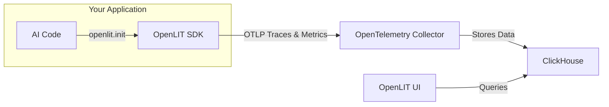

OpenLIT is an open-source AI engineering platform that helps teams build, evaluate, and observe AI applications across the entire lifecycle — from development to production. It provides **OpenTelemetry-native** auto-instrumentation for 50+ LLM providers, AI frameworks, vector databases, and GPUs with a single line of code.

<CardGroup cols={2}>
  <Card title="Deploy OpenLIT" icon="circle-down" href="/openlit/installation">
    Self-host with Docker Compose or Kubernetes Helm in minutes
  </Card>
  <Card title="Quickstart" icon="bolt" href="/openlit/quickstart">
    Get LLM observability running in under 5 minutes
  </Card>
  <Card title="SDK Reference" icon="code" href="/sdk/overview">
    Python, TypeScript, and Go SDKs with zero-code instrumentation
  </Card>
  <Card title="Integrations" icon="plug" href="/sdk/integrations/overview">
    50+ LLM providers, frameworks, and vector databases
  </Card>
</CardGroup>

## What is OpenLIT?

OpenLIT provides three interconnected OSS tools:

<CardGroup cols={3}>
  <Card title="OpenLIT Platform" icon="gauge" href="/openlit/installation">
    Full-stack platform for tracing, dashboards, prompt management, evaluations, and secrets management
  </Card>
  <Card title="OpenLIT SDKs" icon="terminal" href="/sdk/overview">
    OpenTelemetry-native auto-instrumentation SDKs for Python, TypeScript, and Go
  </Card>
  <Card title="Kubernetes Operator" icon="cubes" href="/operator/overview">
    Automatically inject instrumentation into AI workloads without code changes
  </Card>
</CardGroup>

## Key features

<CardGroup cols={2}>
  <Card title="LLM Observability" icon="chart-line" href="/openlit/observability/tracing">
    Distributed tracing and metrics for every LLM call — latency, cost, token usage, and errors
  </Card>
  <Card title="GPU Monitoring" icon="microchip" href="/sdk/features/gpu">
    Real-time NVIDIA and AMD GPU utilization, memory, temperature, and power metrics
  </Card>
  <Card title="Evaluations" icon="ruler" href="/openlit/evaluations/overview">
    LLM-as-a-judge and programmatic evaluations to measure response quality in production
  </Card>
  <Card title="Guardrails" icon="shield" href="/sdk/features/guardrails">
    Real-time prompt injection detection, topic restrictions, and sensitive data protection
  </Card>
  <Card title="Prompt Hub" icon="message" href="/openlit/prompts/prompt-hub">
    Version, manage, and deploy prompts across environments without code changes
  </Card>
  <Card title="Vault" icon="vault" href="/openlit/secrets/vault">
    Centrally store LLM API keys — applications retrieve them remotely at runtime
  </Card>
  <Card title="OpenGround" icon="flask" href="/openlit/experiments/openground">
    Compare cost, latency, and quality across LLMs side-by-side in a playground
  </Card>
  <Card title="Custom Dashboards" icon="grid" href="/openlit/dashboards/overview">
    Build dashboards with flexible widgets and custom SQL queries over your telemetry data
  </Card>
</CardGroup>

## How it works



<Steps>
  <Step title="Deploy OpenLIT">
    Run the OpenLIT stack with Docker Compose — includes the UI, ClickHouse database, and OpenTelemetry Collector.
    ```bash
    git clone https://github.com/openlit/openlit.git
    cd openlit
    docker compose up -d
    ```
  </Step>
  <Step title="Install the SDK">
    Install the OpenLIT Python SDK from PyPI.
    ```bash
    pip install openlit
    ```
  </Step>
  <Step title="Instrument your application">
    Add two lines to your existing AI application — OpenLIT auto-detects and instruments all supported libraries.
    ```python
    import openlit

    openlit.init(otlp_endpoint="http://127.0.0.1:4318")
    ```
  </Step>
  <Step title="Visualize and optimize">
    Open `http://127.0.0.1:3000` and log in with the default credentials (`user@openlit.io` / `openlituser`) to explore traces, metrics, and dashboards.
  </Step>
</Steps>

## Supported integrations

OpenLIT auto-instruments 50+ integrations across LLM providers, AI frameworks, and vector databases:

**LLM Providers** — OpenAI, Anthropic, Cohere, Mistral, Groq, AWS Bedrock, Google Vertex AI, Google AI Studio, Azure OpenAI, Ollama, vLLM, Hugging Face, DeepSeek, and more

**AI Frameworks** — LangChain, LlamaIndex, CrewAI, OpenAI Agents SDK, Pydantic AI, AutoGen (AG2), Haystack, LiteLLM, Mem0, and more

**Vector Databases** — Pinecone, ChromaDB, Qdrant, Milvus, Astra DB, PostgreSQL (pgvector)

**GPUs** — NVIDIA (nvidia-smi), AMD (ROCm)

<Card title="View all integrations" icon="plug" href="/sdk/integrations/overview">
  Browse the full list of supported integrations with setup guides
</Card>

## Open source

OpenLIT is released under the [Apache 2.0 license](https://github.com/openlit/openlit/blob/main/LICENSE). It follows and maintains [OpenTelemetry Semantic Conventions](https://github.com/open-telemetry/semantic-conventions/tree/main/docs/gen-ai) for GenAI observability, consistently updating to align with the latest standards.

<CardGroup cols={2}>
  <Card title="GitHub" icon="github" href="https://github.com/openlit/openlit">
    Star the repo, report issues, and contribute
  </Card>
  <Card title="Slack Community" icon="slack" href="https://join.slack.com/t/openlit/shared_invite/zt-2etnfttwg-TjP_7BZXfYg84oAukY8QRQ">
    Join the community for support and discussions
  </Card>
</CardGroup>
