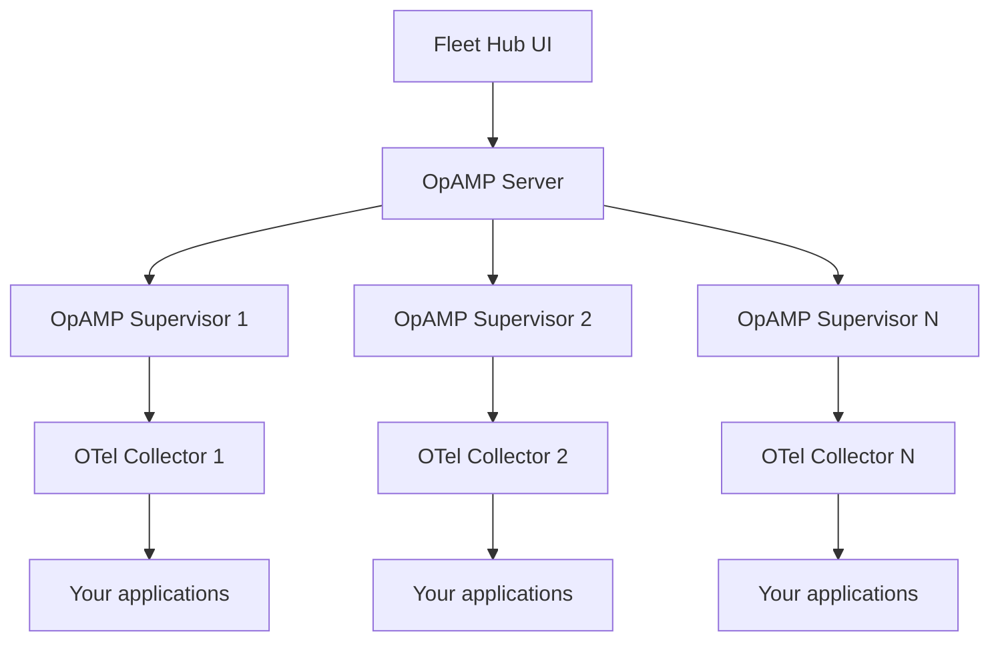

Fleet Hub is OpenLIT's centralized management system for OpenTelemetry Collectors across your infrastructure. Built on the **OpAMP (Open Agent Management Protocol)** standard, it provides real-time health monitoring, remote configuration management, and a unified view of every collector connected to your OpenLIT instance.

<Note>
  Fleet Hub uses the industry-standard OpAMP protocol, ensuring compatibility with the broader OpenTelemetry ecosystem and future-proofing your observability infrastructure.
</Note>

## Architecture

Fleet Hub operates through three components working together:

1. **OpAMP Server** — built into OpenLIT; accepts WebSocket connections from supervisors and distributes configuration updates.
2. **OpAMP Supervisor** — a lightweight process running on each collector host; manages the OpenTelemetry Collector lifecycle and relays health status back to the server.
3. **Fleet Hub UI** — the web interface inside OpenLIT where you monitor and manage all connected collectors.



All communication between the supervisor and the OpAMP Server travels over a TLS-encrypted WebSocket connection on port `4320`.

## Key capabilities

<CardGroup cols={2}>
  <Card title="Real-time monitoring" icon="activity">
    Live health status, component-level diagnostics, resource usage, and uptime for every connected collector.
  </Card>
  <Card title="Remote configuration" icon="sliders">
    Push YAML configuration updates to any collector from the UI without touching the host directly.
  </Card>
  <Card title="Unified dashboard" icon="grid">
    Searchable, filterable list of all collectors with OS type, architecture, version, and connection details.
  </Card>
  <Card title="Standards-based" icon="circle-nodes">
    Implements the OpenTelemetry OpAMP specification with full capability negotiation and bi-directional messaging.
  </Card>
</CardGroup>

## Upgrade notice for existing deployments

<Warning>
  **Upgrading from OpenLIT prior to v1.15.0?** Starting with v1.15.0, the OpenTelemetry Collector runs inside the OpenLIT container. The standalone `otel-collector` container is no longer needed. If you use Docker Compose, you **must** pass `--remove-orphans` when upgrading — otherwise both containers will attempt to bind the same ports (4317, 4318) and startup will fail.
</Warning>

```bash
docker-compose up -d --remove-orphans
```

**What changed in v1.15.0:**

- The OpenTelemetry Collector now runs inside the OpenLIT container.
- An OpAMP Server is bundled for Fleet Hub functionality.
- OTLP ports 4317 and 4318 are now served by the main OpenLIT container.
- Collector configuration is managed centrally through the Fleet Hub UI.

## Getting started

<Steps>
  <Step title="Deploy OpenLIT">
    Make sure OpenLIT is running. Fleet Hub is available at `/fleet-hub` in the OpenLIT UI.

    ```bash
    # Quick start with Docker Compose
    git clone https://github.com/openlit/openlit.git
    cd openlit
    docker-compose up -d
    ```

    After the containers start, navigate to `http://localhost:3000/fleet-hub`.
  </Step>

  <Step title="Install the OpAMP supervisor">
    On each host where you want to manage an OpenTelemetry Collector, download the OpAMP supervisor binary:

    ```bash
    # Download the supervisor binary
    curl -LO https://github.com/open-telemetry/opentelemetry-collector-releases/releases/latest/download/opampsupervisor_linux_amd64

    # Make it executable
    chmod +x opampsupervisor_linux_amd64
    ```
  </Step>

  <Step title="Configure the supervisor">
    Create a `supervisor.yaml` file that points to your OpenLIT instance.

    <Tabs>
      <Tab title="Development">
        ```yaml supervisor.yaml
        server:
          endpoint: wss://your-openlit-host:4320/v1/opamp
          tls:
            insecure_skip_verify: true  # Development only

        agent:
          executable: /usr/local/bin/otelcol-contrib
          config_files:
            - /etc/otel/otel-collector-config.yaml

        capabilities:
          accepts_remote_config: true
          reports_effective_config: true
          reports_own_metrics: false
          reports_own_logs: true
          reports_own_traces: false
          reports_health: true
          reports_remote_config: true

        storage:
          directory: ./storage
        ```
      </Tab>
      <Tab title="Production">
        First, extract the CA and client certificates from the OpenLIT container:

        ```bash
        docker cp openlit:/app/opamp/certs/cert/ca.cert.pem ./ca.cert.pem
        docker cp openlit:/app/opamp/certs/client/client.cert.pem ./client.cert.pem
        docker cp openlit:/app/opamp/certs/client/client.key.pem ./client.key.pem
        ```

        Then configure the supervisor with mutual TLS:

        ```yaml supervisor.yaml
        server:
          endpoint: wss://your-openlit-host:4320/v1/opamp
          tls:
            insecure_skip_verify: false
            ca_file: /path/to/ca.cert.pem
            cert_file: /path/to/client.cert.pem
            key_file: /path/to/client.key.pem

        agent:
          executable: /usr/local/bin/otelcol-contrib
          config_files:
            - /etc/otel/otel-collector-config.yaml

        capabilities:
          accepts_remote_config: true
          reports_effective_config: true
          reports_own_metrics: false
          reports_own_logs: true
          reports_own_traces: false
          reports_health: true
          reports_remote_config: true

        storage:
          directory: ./storage
        ```
      </Tab>
    </Tabs>

    <Warning>
      Never use `insecure_skip_verify: true` in production. Always provide a CA certificate and, in production mode, client certificates for mutual TLS.
    </Warning>
  </Step>

  <Step title="Start the supervisor">
    ```bash
    ./opampsupervisor_linux_amd64 --config supervisor.yaml
    ```

    The supervisor connects to the OpAMP Server and the collector appears in the Fleet Hub dashboard within a few seconds.
  </Step>

  <Step title="Verify in Fleet Hub">
    Open Fleet Hub in the OpenLIT UI. You should see the newly connected collector in the list with a healthy status indicator. Click it to view system information, component health, and the current effective configuration.
  </Step>
</Steps>

## Environment configuration

Configure the OpAMP Server behavior by setting environment variables before starting OpenLIT:

| Variable | Default | Description |
|---|---|---|
| `OPAMP_ENVIRONMENT` | `development` | Environment mode: `development`, `production`, or `testing` |
| `OPAMP_TLS_INSECURE_SKIP_VERIFY` | `true` | Skip certificate verification (development only) |
| `OPAMP_TLS_REQUIRE_CLIENT_CERT` | `false` | Require client certificates for mutual TLS |
| `OPAMP_TLS_MIN_VERSION` | `1.2` | Minimum TLS version accepted |
| `OPAMP_TLS_MAX_VERSION` | `1.3` | Maximum TLS version accepted |
| `OPAMP_LOG_LEVEL` | `info` | Logging verbosity: `debug`, `info`, `warn`, `error` |

<Warning>
  The default configuration uses `OPAMP_TLS_INSECURE_SKIP_VERIFY=true`, which is suitable for local development only. Set `OPAMP_ENVIRONMENT=production` and `OPAMP_TLS_INSECURE_SKIP_VERIFY=false` for any production deployment.
</Warning>

## Managing collectors

### Viewing collector details

Click any collector in the Fleet Hub list to see:

- **System information** — OS type, CPU architecture, hostname, collector version
- **Component health** — per-component status for receivers, processors, and exporters
- **Effective configuration** — the configuration currently running on the collector (read-only)
- **Custom configuration** — a YAML editor where you can author and push remote configuration
- **Connection metrics** — uptime, start time, and reconnection history

### Updating configurations remotely

1. Select a collector from the Fleet Hub list.
2. Navigate to the **Configuration** tab.
3. Edit the custom configuration in the YAML editor.
4. Click **Save** to deploy the change.
5. Watch the **Effective Configuration** panel update to reflect the applied change.

<Warning>
  Configuration changes are applied immediately to the running collector. Validate your YAML syntax before saving to avoid interrupting telemetry collection.
</Warning>

### Health monitoring

Fleet Hub monitors health at three levels:

- **Collector health** — overall up/down status reported by the supervisor
- **Component health** — individual receiver, processor, and exporter status with error messages
- **Resource health** — CPU and memory usage on the collector host

## Certificate management

When OpenLIT starts, it automatically generates a set of TLS certificates for the OpAMP Server:

- **CA certificate** — self-signed root, valid for 10 years, 4096-bit RSA key
- **Server certificate** — signed by the CA, valid for 1 year
- **Client certificate** — for mutual TLS authentication in production mode

To use your own certificates in production, copy them into the running container and restart:

```bash
docker cp your-ca.cert.pem openlit:/app/opamp/certs/cert/ca.cert.pem
docker cp your-server.cert.pem openlit:/app/opamp/certs/server/server.cert.pem
docker cp your-server.key.pem openlit:/app/opamp/certs/server/server.key.pem
docker-compose restart openlit
```

## Troubleshooting

<AccordionGroup>
  <Accordion title="Collector not appearing in Fleet Hub">
    1. Test connectivity to the OpAMP port:
       ```bash
       telnet your-openlit-instance 4320
       ```
    2. Run the supervisor with verbose logging to see the connection attempt:
       ```bash
       ./opampsupervisor --config supervisor.yaml --verbose
       ```
    3. Verify that TLS settings match between the supervisor config and the OpAMP Server. If you're in development, confirm `insecure_skip_verify: true` is set in `supervisor.yaml`.
  </Accordion>

  <Accordion title="Configuration updates not applied">
    1. Check supervisor logs for YAML parsing errors.
    2. Confirm the supervisor has write permission on the collector config file path.
    3. Look at the **Effective Configuration** panel — if it updated but the collector behaviour didn't change, the issue is likely in the collector pipeline definition itself.
  </Accordion>

  <Accordion title="'Certificate signed by unknown authority' error">
    The supervisor doesn't trust the self-signed CA certificate generated by OpenLIT.

    - **Development**: Set `insecure_skip_verify: true` in `supervisor.yaml`.
    - **Production**: Extract the CA certificate and provide its path via `ca_file` in `supervisor.yaml`:
      ```bash
      docker cp openlit:/app/opamp/certs/cert/ca.cert.pem ./ca.cert.pem
      ```
  </Accordion>

  <Accordion title="'Connection refused' on port 4320">
    1. Check that the OpenLIT container is running: `docker-compose ps`
    2. Verify port mapping: `docker-compose port openlit 4320`
    3. Check that port 4320 is not blocked by a firewall between the supervisor host and the OpenLIT host.
  </Accordion>

  <Accordion title="Expired certificate errors">
    Restart the OpenLIT container to regenerate certificates:
    ```bash
    docker-compose restart openlit
    ```
    To inspect the current expiry date before restarting:
    ```bash
    docker exec openlit openssl x509 -in /app/opamp/certs/server/server.cert.pem -noout -dates
    ```
  </Accordion>
</AccordionGroup>

---

<CardGroup cols={3}>
  <Card title="Quickstart: LLM Observability" href="/openlit/quickstart" icon="bolt">
    Production-ready AI monitoring setup in a single line of code
  </Card>
  <Card title="Tracing" href="/openlit/observability/tracing" icon="activity">
    View and analyze distributed traces from your AI applications
  </Card>
  <Card title="Integrations" href="/sdk/integrations/overview" icon="circle-nodes">
    60+ AI integrations with automatic instrumentation and performance tracking
  </Card>
</CardGroup>
