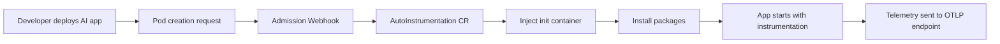

The **OpenLIT Operator** brings zero-code AI observability to Kubernetes environments. It automatically injects instrumentation into your AI applications using OpenTelemetry to produce distributed traces and metrics — **without requiring any code changes**.

Built specifically for AI workloads, the operator provides seamless observability for LLMs, vector databases, and AI frameworks running in Kubernetes. It watches for label selectors on your pods, intercepts pod creation via a mutating admission webhook, injects an init container that installs the instrumentation packages, and mounts them into your application container at startup.

## How it works

When you create an `AutoInstrumentation` custom resource and label your pods to match its selector, the operator's admission webhook intercepts each pod creation request and mutates the pod spec to add:

- An **init container** that copies instrumentation packages to a shared volume
- **Environment variables** that configure OpenTelemetry (service name, OTLP endpoint, resource attributes)
- A **volume mount** so the application container picks up the instrumentation via `PYTHONPATH`

Your application code is never changed. When the pod starts, instrumentation is active automatically.

## Key benefits

- **Zero code changes** — instrument existing AI applications by adding a label
- **OpenTelemetry-native** — built on OTel standards, compatible with any OTLP-compatible backend
- **Provider flexibility** — choose from OpenLIT, OpenInference, OpenLLMetry, or bring your own image
- **Kubernetes-native** — uses CRDs, admission webhooks, and RBAC following Kubernetes patterns

## What gets instrumented

<CardGroup cols={3}>
  <Card title="LLM Providers" icon="brain">
    OpenAI, Anthropic, Google, Azure OpenAI, AWS Bedrock, Ollama, Groq, Cohere, Mistral, and more
  </Card>
  <Card title="AI / Agentic Frameworks" icon="cube">
    LangChain, LlamaIndex, CrewAI, Haystack, AG2, DSPy, Guardrails, and more
  </Card>
  <Card title="Vector Databases" icon="database">
    ChromaDB, Pinecone, Qdrant, Milvus, Weaviate, and more
  </Card>
</CardGroup>

## Supported languages

<CardGroup cols={3}>
  <Card title="Python" icon="python">
    **Full support**

    Complete instrumentation for all Python-based AI applications and AI agents
  </Card>
  <Card title="JavaScript" icon="node-js">
    **Coming soon**

    Complete instrumentation for all JS/TS-based AI applications and AI agents
  </Card>
  <Card title="More languages" icon="code">
    **Roadmap**

    Java, Go, and other languages planned for future releases
  </Card>
</CardGroup>

## Get started

<CardGroup cols={2}>
  <Card title="Quickstart" href="/operator/quickstart" icon="bolt">
    Get the operator running and instrumenting a workload in 5 minutes
  </Card>
  <Card title="Installation" href="/operator/installation" icon="circle-down">
    Full installation guide including prerequisites, Helm, and upgrade paths
  </Card>
  <Card title="Instrumentations" href="/operator/instrumentations" icon="circle-nodes">
    Learn about supported providers and how to annotate your deployments
  </Card>
  <Card title="Destinations" href="/operator/destinations" icon="link">
    Send telemetry to OpenLIT, Grafana Cloud, Datadog, SigNoz, New Relic, and more
  </Card>
</CardGroup>
