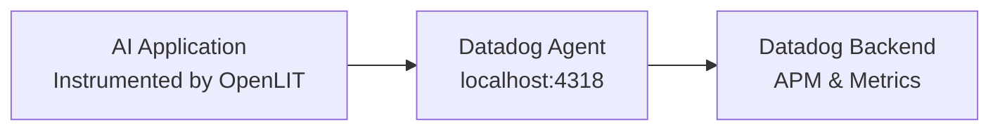

Datadog accepts OpenTelemetry data through the Datadog Agent's built-in OTLP receiver. Your application sends traces and metrics to the local Datadog Agent over `localhost:4318`, and the agent forwards them to the Datadog backend using your configured API key.



## Prerequisites

This guide assumes you have a Datadog Agent already installed and configured with OTLP ingestion enabled. If you need to install the agent, refer to the [Datadog Agent Installation Guide](https://docs.datadoghq.com/agent/).

To enable OTLP in the Datadog Agent, add the following to your `datadog.yaml`:

```yaml
otlp_config:
  receiver:
    protocols:
      http:
        endpoint: 0.0.0.0:4318
```

## Get started

<Steps>
  <Step title="Install the OpenLIT SDK">
    <Tabs>
      <Tab title="Python">
        ```shell
        pip install openlit
        ```
      </Tab>
      <Tab title="TypeScript">
        ```shell
        npm install openlit
        ```
      </Tab>
    </Tabs>
  </Step>

  <Step title="Configure the SDK to send to the Datadog Agent">
    Point `otlp_endpoint` at the Datadog Agent running on localhost. No API key or authentication header is needed in the application — the agent handles authentication to the Datadog backend.

    <Tabs>
      <Tab title="Python">
        **Using function arguments:**

        ```python
        import openlit

        openlit.init(
            otlp_endpoint="http://localhost:4318"
        )
        ```

        **Using environment variables:**

        ```shell
        export OTEL_EXPORTER_OTLP_ENDPOINT="http://localhost:4318"
        export OTEL_SERVICE_NAME="my-ai-service"
        export OTEL_DEPLOYMENT_ENVIRONMENT="production"
        ```

        ```python
        import openlit

        openlit.init()
        ```
      </Tab>
      <Tab title="TypeScript">
        **Using function arguments:**

        ```typescript
        import Openlit from 'openlit';

        Openlit.init({
            otlpEndpoint: 'http://localhost:4318'
        });
        ```

        **Using environment variables:**

        ```shell
        export OTEL_EXPORTER_OTLP_ENDPOINT="http://localhost:4318"
        ```

        ```typescript
        import Openlit from 'openlit';

        Openlit.init();
        ```
      </Tab>
    </Tabs>

    <Note>
      The Datadog Agent handles authentication and forwarding to Datadog. You do not need to set `otlp_headers` or a Datadog API key in your application configuration.
    </Note>
  </Step>
</Steps>

## Full example

```python
import openlit
import openai

openlit.init(
    otlp_endpoint="http://localhost:4318",
    service_name="my-ai-service",
    environment="production"
)

client = openai.OpenAI()
response = client.chat.completions.create(
    model="gpt-4o",
    messages=[{"role": "user", "content": "Hello!"}]
)
print(response.choices[0].message.content)
```

Traces appear in Datadog APM under the service name `my-ai-service`.

---

<CardGroup cols={3}>
  <Card title="Send to OpenLIT" href="/sdk/destinations/openlit" icon="server">
    Send to a self-hosted OpenLIT platform instance
  </Card>
  <Card title="Send to Grafana Cloud" href="/sdk/destinations/grafana" icon="chart-line">
    Configure the Grafana OTLP gateway endpoint and Basic Auth headers
  </Card>
  <Card title="Integrations" href="/sdk/integrations/overview" icon="circle-nodes">
    60+ LLM providers, AI frameworks, and vector databases
  </Card>
</CardGroup>
