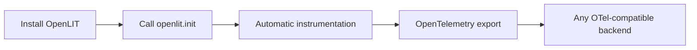

The OpenLIT SDK is an open-source, OpenTelemetry-native observability library that instruments your AI applications automatically. You add two lines of code (or zero, using the CLI), and OpenLIT begins capturing distributed traces, token usage, latency, cost, and more across every LLM call, agent workflow, and vector database operation.

## How it works



OpenLIT patches supported libraries at import time. When your code calls OpenAI, LangChain, Pinecone, or any other supported integration, OpenLIT automatically creates spans with rich AI-specific attributes — no manual instrumentation required.

You can also run with **zero code changes** using the CLI:

```bash
openlit-instrument python your_app.py
```

## Key capabilities

| Capability | Description |
|---|---|
| **Distributed tracing** | End-to-end traces across HTTP → framework → LLM → agent → tool |
| **Token and cost tracking** | Per-call token usage and USD cost from a built-in pricing database |
| **GPU monitoring** | Utilization, memory, temperature, and power for NVIDIA and AMD GPUs |
| **Guardrails** | Real-time prompt injection, sensitive topic, and topic restriction detection |
| **Evaluations** | Programmatic hallucination, bias, and toxicity scoring |
| **Metrics** | Latency histograms, error rates, and throughput via OpenTelemetry metrics |

## Supported languages

<CardGroup cols={3}>
  <Card title="Python" icon="python">
    Complete AI observability with automatic dependency detection. Instruments LLMs, frameworks, vector databases, and GPUs.
  </Card>
  <Card title="TypeScript / JavaScript" icon="node-js">
    Full LLM monitoring for Node.js applications with distributed tracing, metrics, and cost optimization.
  </Card>
  <Card title="Go" icon="golang">
    OpenTelemetry-native instrumentation for Go. Wrap your OpenAI and Anthropic clients for automatic tracing, token tracking, and cost monitoring.
  </Card>
</CardGroup>

## Supported integrations

<CardGroup cols={2}>
  <Card title="LLM providers" icon="brain">
    OpenAI, Anthropic, Google Gemini, Azure OpenAI, AWS Bedrock, Ollama, Groq, Cohere, Mistral, and more
  </Card>
  <Card title="AI and agentic frameworks" icon="cube">
    LangChain, LlamaIndex, CrewAI, mem0, AG2, DSPy, Agno, and more
  </Card>
  <Card title="Vector databases" icon="database">
    ChromaDB, Pinecone, Qdrant, Milvus, Weaviate, and more
  </Card>
  <Card title="GPU hardware" icon="server">
    NVIDIA and AMD GPUs via OpenTelemetry metrics
  </Card>
  <Card title="HTTP frameworks and clients" icon="globe">
    FastAPI, Flask, Django, Requests, HTTPX, aiohttp, urllib, and more
  </Card>
</CardGroup>

## Get started

<CardGroup cols={2}>
  <Card title="Quickstart" href="/sdk/quickstart" icon="bolt">
    Get your first trace in under five minutes
  </Card>
  <Card title="Configuration" href="/sdk/configuration" icon="sliders">
    All openlit.init() parameters and environment variables
  </Card>
  <Card title="Integrations" href="/sdk/integrations/overview" icon="circle-nodes">
    60+ integrations with automatic instrumentation
  </Card>
  <Card title="Destinations" href="/sdk/destinations/overview" icon="link">
    Send telemetry to Datadog, Grafana, New Relic, Dash0, and more
  </Card>
</CardGroup>
